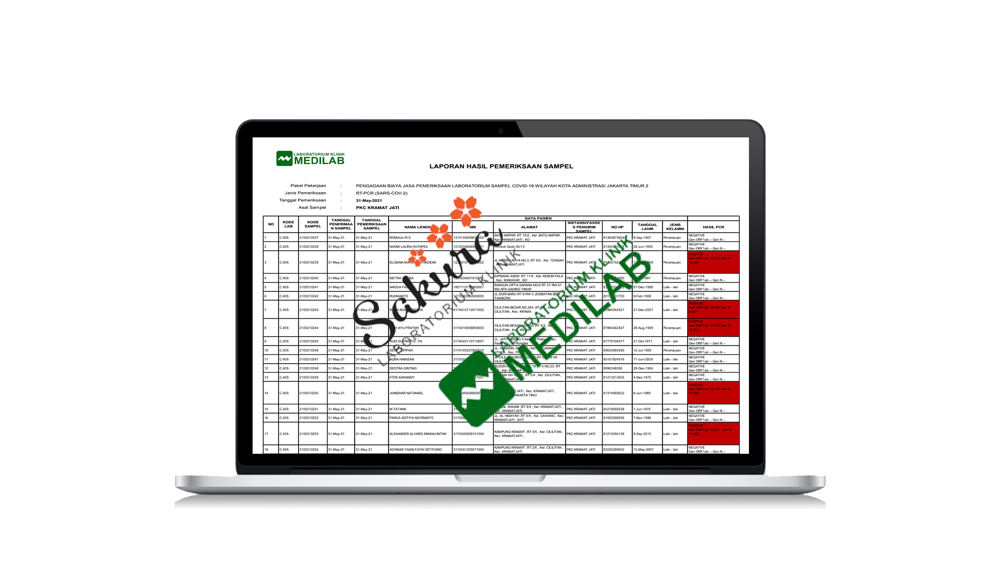

# Profile
---

 Venu Fitratama | West Borneo, Indonesia 

 Business Analyst | Data Analyst | Business Development 

 

---
# Education
---
### Tanjungpura University
[Master Degree of Economics and Business](https://pascasarjanafe.untan.ac.id) 
West Borneo, Indonesia | 2022 - 2023 
GPA 3.94/4.00 | [Transcript](https://drive.google.com/file/d/1Tr6bQAVbvyJZx-nVbfiuxeoPcm97NuZ6/view?usp=share_link)

---
### Hacktiv8 Indonesia
[Full Time Data Science](https://www.hacktiv8.com/data-science) 
Jakarta, Indonesia | 2022 
Final Score 86.52/100 (A) | [Transcript](https://drive.google.com/file/d/1ciGNs2x2ByF79iZUiVkkt5b0gOE23pHD/view?usp=share_link)

---
### Tanjungpura University
[Bachelor Degree of Economics and Business](https://feb.untan.ac.id) 
West Borneo, Indonesia | 2016 - 2020 
GPA 3.60/4.00 | [Transcript](https://drive.google.com/file/d/1xALLspa37JvIsHPieqopuR2UE-kLEjR4/view?usp=share_link)

---
# Technical Skill
---
 
 
 
 
 
 
 
 
 
 
 

---
# Work Experience
---
## [Robotop Indonesia](https://robotop.id/id)

### Business Development | Feb 2023 - Present

- Making promotion decisions based on available advertising data to reach a wider client base.

- Developing a specialized e-commerce application for forex trading for the Indonesian market.

- Conducting business development by testing health products in the Pontianak market.

---

## [CV Bintang Pasific Globalindo](https://www.instagram.com/commerce.bpg/?hl=en)

### Business Analyst | Oct 2022 - Jan 2023

- Create salesman presentation dashboard every month for a period of 1 month to see salesman KPIs.

- Evaluating the company's needs, particularly for sales officers and developing solutions to meet those needs.

---
## [PT Sakura Diagnostika Medika](http://covid19.labsakura.id)

### Business Analyst | Jan 2022 - Jan 2023

- Performed calculations to open or close a new operational branch by using an internal program called Biosys Lab Software combined with pivot table.

- Make decisions to hire or fire an employee for business effectiveness and efficiency.

---
## [PT Prima Indo Medilab](https://medilab.co.id/profil-perusahaan/)

### Project Manager | Oct 2020 - Dec 2021

- Create daily, weekly and monthly report dashboard of Covid-19 case in East Jakarta.

- Pro-active as a team leader to manage the team work system.

---
# Work Portfolio
---
### Robotop Indonesia Ads Report (Sample)

Robotop is a provider of high-tech smart trading robot applications with hybrid trading system.

---
### Bintang Pasific Globalindo Sales Report (Sample)

Bintang Pacific Globalindo is a company engaged in the distribution of Fast Moving Consumer Goods in Pontianak.

---
### Sakura Diagnostika Medika & Prima Indo Medilab (Ms. Excel Sample)

PT Sakura Diagnostika Medika & PT Prima Indo Medilab are company that operates in the Hospital & Health Care industry.

---
# Data Analyst | Data Science Project Portfolio
---

### Bike Sales Distribution

 

According to this sales data, the records of sales is from 2011 - 2016, with detail of products info, customers info and price and profit per product. Since we need to know which country have most buyers, how much profit the store make and what kind of products category have most sales, i will explore more about this data especially on country, state, sub category products and how much profit do they earn. This data exploration will answer these questions : What is the most product sales in every year? Who is the most segmented gender that buy the product? Where is the most product sold? When is the company have most profit margin? Why did the company should expand or not? and How is the increase or decrease of profit every year?

 

 

---
### Machine Failure & Credit Card Predictions using Machine Learning

[-orange)](https://docs.google.com/presentation/d/1LdOXXjdlF2dYMtwN1gYybLzvjrmSTs7g/edit?usp=share_link&ouid=102297297446553873586&rtpof=true&sd=true)
[-orange)](https://github.com/venufitratama/Machine-Learning-Prediction/blob/master/Machine%20Failure%20Prediction.ipynb) 
[-orange)](https://docs.google.com/presentation/d/11_aVfYqRvZBaWyOR5VzPtvrXegg8-whJ/edit?usp=share_link&ouid=102297297446553873586&rtpof=true&sd=true)
[-orange)](https://github.com/venufitratama/Machine-Learning-Prediction/blob/master/Credit%20Card%20Payment%20Prediction.ipynb.ipynb)

Create a classification model to predict machine failure & default payment next month with the datasets. implementing supervised learning and unsupervised learning, model evaluation, model tuning, and model deployment. Scikit-learn was used as machine learning library. Scikit-learn model used are Logistic Regression, Support Vector Machine, K-Nearest Neighbors, Gaussian Naive Bayes, Random Forest, Adaptive Boost

 

 

---
### Customer Churn Prediction using Deep Learning

Create a Deep Learning Model - Artificial Neural Network to see Telco Customer Churn. Library used are scikit-learn, tensorflow & keras. In the inference model, there are 81 data on label No and 19 data on label Yes, whereas in the original dataset, there are 79 data on label No and 21 data on label Yes.

 

 

---
### Image Classification for Healthy and Diseased Leaves using Computer Vision

Using the concept of Computer Vision/NLP, preparing data for use in the Computer Vision/NLP model taken from kaggle. Implementing Artificial Neural Network with existing data. Analyzing and explaining the layers created. Library used are Tensorflow & Keras

 

 

---
### Twitter Engagement for Stock Price Analysis using NLP, GRU & LSTM methods

On the off chance which stocks do we actually need to purchase? To help answering that question, the model was created, “Twitter Engagement for Stock prIce Analysis - Sentiment CLASSification (TESIA - S Class)” to make it less demanding to decide the stock to be acquired according to time series prediction and twitter sentimental classification.

 

 

---
# Related Certificate
---
- [Full Time Data Science](https://drive.google.com/file/d/1xuWcZk6LoczBkuXzIWtOOZmrS9rE_Ski/view?usp=share_link) Issued by Hacktiv8 Indonesia 
- [Python (Basic)](https://www.hackerrank.com/certificates/a68f8db09c55), [SQL (Basic)](https://www.hackerrank.com/certificates/36bdeadc3b98), [SQL (Intermediate)](https://www.hackerrank.com/certificates/6b5ffdee1c65) Issued by HackerRank 
- [Tax Bases](https://drive.google.com/file/d/1vkC_yaqa0pwX9cTSDC9kFFOKlo9Q30xG/view?usp=sharing) Issued by SpectraCentre 
- [Liaison Staff](https://drive.google.com/file/d/1rQD05lncbnxb96P7LjfIOB3nf7ifAC__/view?usp=share_link) Issued by ISC Tanjungpura University 
- [ITP TOEFL](https://drive.google.com/file/d/1G6ejs-0-4Xd2uz3ZfijxetU72RR5VMQM/view?usp=share_link) Issued by IIEF 

---
# Other
---
- [Bachelor's Thesis Proposal](https://drive.google.com/file/d/14V2TX_l2ha0qgNrTo3ST6iFWaCYoai1M/view?usp=share_link)

Title: Determinant of Free Cash Flow, Life Cycle, Firm Size, Leverage, Assets Growth and Investment Opportunity Set on Dividend of Manufacturing Companies that Listed in Indonesia Stock Exchange.
 

- [Master's Thesis Proposal]()

Still Working on it...
 

---

ⓒ Feb 2023
